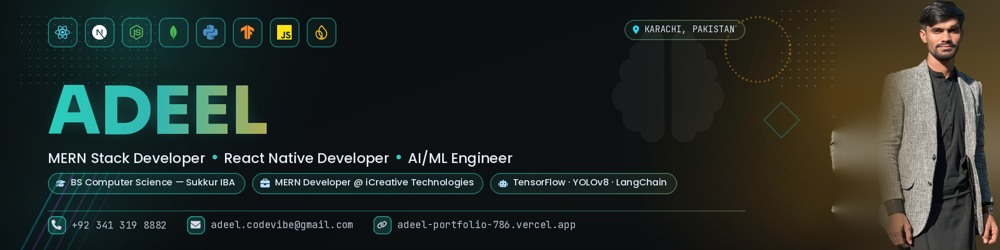

  

# Hi, I'm Adeel 👋

### MERN Stack Developer · React Native Developer · AI/ML Engineer · LLM & Automation

I build production-ready web and mobile applications, and engineer computer vision and LLM-powered systems that ship to real devices and real users.

📍 Karachi, Pakistan

---

## 🧠 About Me

I'm an **AI/ML Engineer and MERN Stack Developer** currently pursuing a BS in Computer Science at **Sukkur IBA University**. I specialize in:

- 🤖 Engineering computer vision models (**CNN, YOLOv8, TensorFlow/Keras**) and deploying them on-device with **TensorFlow Lite**
- 🌐 Building full-stack web applications with **React.js, Node.js, Express.js, and MongoDB Atlas**
- 📱 Developing cross-platform mobile apps with **React Native and Redux**
- ⚡ Implementing **LLM automation pipelines** with **LangChain**, deployed on **GCP** and **Vercel**
- 🔐 Integrating secure REST APIs with **JWT authentication**

---

## 🛠️ Tech Stack

### AI / ML

### LLM & Automation

### Frontend & Mobile

### Backend & Databases

### Languages

### Deployment & Tools

### Data Tools

---

## 💼 Work Experience

### MERN Stack Developer — iCreative Technologies
**Karachi, Pakistan** | *Dec 2024 – Jun 2025*

<table>
<tr>
<td width="40%"><b>💰 Budget Tracker</b> React.js · Node.js · Express.js · MongoDB Atlas</td>
<td>Built a finance app supporting 5+ transaction categories with real-time balance tracking and visual spending charts. Secured all endpoints with JWT authentication and managed client-side state with Redux.</td>
</tr>
<tr>
<td><b>🌦️ Weather Application</b> React.js · Node.js · OpenWeatherMap API</td>
<td>Created a real-time weather app delivering current conditions and a 7-day forecast. Proxied API keys through a Node.js backend to protect credentials, with a fully responsive Tailwind CSS frontend.</td>
</tr>
<tr>
<td><b>🚢 Dock Port Management</b> React.js</td>
<td>Delivered a port operations dashboard featuring 3+ data tables and real-time activity views, enabling dock supervisors to monitor and manage all port operations from a single interface — eliminating manual cross-referencing.</td>
</tr>
</table>

---

## 🚀 Featured Projects

### 🤝 AI Sales Agent Web Platform
`React.js` `Node.js` `MongoDB` `LangChain` `LLM Automation`

A fully automated, two-phase AI-driven sales conversation system.

- Built a React.js dashboard for uploading customer lists (name + email), stored in MongoDB
- **Phase 1:** User submits a query with a customer name → an LLM generates a personalized outreach email and sends it automatically
- **Phase 2:** Incoming replies are saved to MongoDB, analyzed by the LLM, and an auto-reply is generated and sent — closing the loop into a complete automated sales conversation

> **Highlight:** End-to-end LLM automation pipeline that handles both outbound personalization and inbound reply intelligence with no manual intervention.

---

### 🚦 Traffic Violation Detection System
`YOLOv8` `React Native` `Google Cloud` `Firebase`

A computer vision system for detecting real-world traffic violations from images and video.

- Constructed a custom-trained YOLOv8 model to detect traffic violations from both images and video files
- Integrated detection results into a React Native mobile app
- Used Firebase for user authentication and detection history storage
- Deployed the inference server on **Google Cloud Run** with auto-scaling for variable workloads

> **Highlight:** Production-grade computer vision pipeline served via an auto-scaling cloud inference endpoint.

---

### 🩺 Pneumonia Detection App
`CNN` `TensorFlow` `TensorFlow Lite` `React Native`

An offline, on-device medical imaging diagnostic tool.

- Fine-tuned a CNN on chest X-ray data using TensorFlow/Keras
- Converted the trained model to **TensorFlow Lite** for mobile deployment
- Embedded the model directly into a React Native app, enabling fully offline, on-device predictions with **no internet connection required**

> **Highlight:** Real medical-imaging inference running entirely on-device — privacy-preserving and usable without connectivity.

---

### 🗺️ GPS Tracker App
`React Native` `Google Maps API` `Firebase Realtime DB`

A cross-platform live transit tracking application.

- Architected a cross-platform app integrating the Google Maps API to display bus routes and a live map UI
- Stored bus route data and schedule times in Firebase Realtime DB
- Implemented Firebase Authentication for secure user access

> **Highlight:** Real-time geolocation data synced through Firebase for a seamless cross-platform experience.

---

### 🛒 E-Commerce Website
`React.js` `Node.js` `Express.js` `Firebase` `Vercel`

A full-stack online store, live in production.

- Launched a full-stack e-commerce store with product listings, cart, and checkout — deployed live on Vercel
- Integrated the Amazon API for product data
- Built a Node.js/Express REST API to manage orders
- Used Firebase for authentication and real-time data

> **Highlight:** Live, deployed full-stack commerce flow from product discovery through checkout.

---

## 🎓 Education

**BS in Computer Science**
Sukkur IBA University · CGPA: 3.33 · *Aug 2023 – Present*

**Relevant Coursework:** Machine Learning · Data Science · AI · Data Structures & Algorithms · Database Systems · OOP · Web Engineering

---

## 📜 Certifications

- 🏅 **Start Writing Prompts Like a Pro** — Coursera
- 🏅 **Use AI as a Creative or Expert Partner** — Coursera

---

## 📬 Let's Connect

*Open to MERN Stack, React Native, and AI/ML engineering opportunities.*

